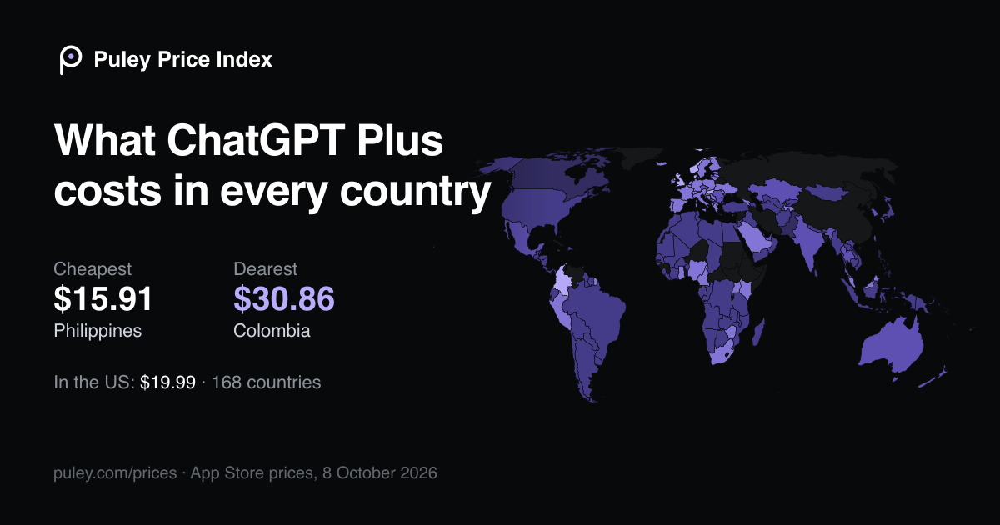

# Puley Price Index

**What popular subscriptions cost in every App Store country.** The same ChatGPT Plus, Claude Pro or YouTube Premium plan,
priced in each of 174 countries, in local money and in US dollars, read straight from each country's App Store and updated daily.

Browse it at **[puley.com/prices](https://puley.com/prices)**: a world map per app, every country's price, and a page per country.

[](https://puley.com/prices/chatgpt)

[](https://creativecommons.org/licenses/by/4.0/)
[](LICENSE)
[](pyproject.toml)

<!-- index:start -->
**Updated 2026-10-09** · 12,200 prices · 16 apps · 174 countries · US dollars at 2026-10-09 exchange rates

| App | Main plan | In the US | Cheapest | Dearest | Countries |
| --- | --- | ---: | --- | --- | ---: |
| [Character.AI](https://puley.com/prices/character-ai) | Character.AI+ | $9.99 | 🇪🇬 Egypt $5.73 | 🇨🇴 Colombia $18.51 | 153 |
| [ChatGPT](https://puley.com/prices/chatgpt) | ChatGPT Plus | $19.99 | 🇵🇭 Philippines $15.86 | 🇨🇴 Colombia $30.87 | 168 |
| [Claude](https://puley.com/prices/claude) | Claude Pro - Monthly | $20.00 | 🇵🇰 Pakistan $17.69 | 🇨🇴 Colombia $30.87 | 165 |
| [Google Gemini](https://puley.com/prices/gemini) | Google AI Pro (5 TB) | $19.99 | 🇮🇩 Indonesia $17.27 | 🇳🇴 Norway $27.07 | 167 |
| [Grok](https://puley.com/prices/grok) | SuperGrok | $30.00 | 🇹🇷 Turkey $26.38 | 🇳🇴 Norway $41.70 | 155 |
| [Le Chat (Vibe by Mistral)](https://puley.com/prices/le-chat) | Vibe Pro | $14.99 | 🇵🇭 Philippines $12.68 | 🇨🇴 Colombia $21.60 | 174 |
| [Microsoft Copilot](https://puley.com/prices/copilot) | Microsoft 365 Premium Monthly | $19.99 | 🇳🇬 Nigeria $12.77 | 🇳🇴 Norway $27.07 | 165 |
| [Perplexity](https://puley.com/prices/perplexity) | Perplexity Pro | $20.00 | 🇨🇦 Canada $17.57 | 🇨🇴 Colombia $30.87 | 163 |
| [CapCut](https://puley.com/prices/capcut) | Pro Monthly Subscription | $19.99 | 🇵🇭 Philippines $7.62 | 🇵🇱 Poland $38.37 | 165 |
| [Crunchyroll](https://puley.com/prices/crunchyroll) | Fan | $9.99 | 🇵🇰 Pakistan $1.01 | 🇨🇭 Switzerland $10.69 | 169 |
| [Google One](https://puley.com/prices/google-one) | 100 GB Month | $1.99 | 🇷🇺 Russia $1.51 | 🇨🇴 Colombia $2.75 | 137 |
| [HBO Max](https://puley.com/prices/hbo-max) | Standard | $18.49 | 🇵🇰 Pakistan $2.89 | 🇨🇭 Switzerland $20.30 | 90 |
| [Notion](https://puley.com/prices/notion) | Notion – Plus Monthly | $11.99 | 🇹🇷 Turkey $10.15 | 🇨🇴 Colombia $18.51 | 173 |
| [Telegram Premium](https://puley.com/prices/telegram) | Telegram Premium | $4.99 | 🇨🇱 Chile $3.27 | 🇭🇺 Hungary $7.01 | 170 |
| [X Premium](https://puley.com/prices/x) | X Premium (Monthly) | $11.00 | 🇹🇷 Turkey $4.06 | 🇬🇧 United Kingdom $14.54 | 170 |
| [YouTube Premium](https://puley.com/prices/youtube) | YouTube Premium | $20.99 | 🇮🇳 India $2.01 | 🇩🇰 Denmark $31.29 | 112 |
<!-- index:end -->

## What's in it

| File | What it holds |
| --- | --- |
| [`data/latest/prices.csv`](data/latest/prices.csv) | Every plan of every app in every country: the price as Apple prints it, the number, the currency, US dollars, the gap from the US, and the "feels like" price |
| [`data/latest/index.json`](data/latest/index.json) | One line per app (its main plan, US price, cheapest and dearest country) and per country |
| `data/latest/apps/<app>.json` | Every plan of one app, every country, with rankings |
| `data/latest/countries/<cc>.json` | Every app's main plan in one country |
| [`data/history/changes.csv`](data/history) | Every local price change since tracking began: date, app, plan, country, old price, new price |
| `data/archive/<year>/<date>.json.gz` | The plan names and prices exactly as each store showed them that day |
| [`data/storefronts.json`](data/storefronts.json) | Apple's 174 App Store countries |
| `data/rates/` | The day's exchange rates and the World Bank price levels |

Quick links that always serve the newest data (they allow other sites to read them):

```
https://cdn.jsdelivr.net/gh/cventuresza-tech/puley-price-index@main/data/latest/index.json
https://cdn.jsdelivr.net/gh/cventuresza-tech/puley-price-index@main/data/latest/apps/chatgpt.json
https://puley.com/prices/data/prices.csv
```

## Put a live price on your page

```html
<a class="puley-price" data-app="chatgpt" data-cc="NG" href="https://puley.com/prices/chatgpt">Puley Price Index</a>
<script async src="https://puley.com/embed.js"></script>
```

Pick any app, plan and country at [puley.com/prices/embed](https://puley.com/prices/embed).

## How it's measured

Each app's App Store page lists its in-app purchases with the price in that country. The collector reads that page in every
App Store country, in English, so plan names match across countries, and keeps the store's own currency code (so "$" in Mexico
is pesos, not dollars). The page doesn't say whether a price is monthly or yearly: the name decides when it says ("Monthly",
"12 months"), otherwise the prices do (a second price 7–14× the first is the yearly one), and a country listing a lone price is
checked against the plan's monthly price elsewhere. One-off purchases (credit packs, coins) are left out.

US dollars use that day's rates from [Rates By Exchange Rate API](https://www.exchangerate-api.com). "Feels like" divides the
dollar price by the country's price level (World Bank: PPP conversion factor ÷ official exchange rate), so you can see what a
price weighs on a local budget. Full method and limits: [puley.com/prices/about](https://puley.com/prices/about).

Things to keep in mind: App Store prices usually include VAT (US prices exclude sales tax), a company's own website can charge
differently, and Apple shows at most ten purchases per app.

## Run it yourself

Python 3.11+ and nothing else: the collector uses only the standard library.

```bash
python -m puley_price_index collect chatgpt claude   # read today's prices (politely: one page every few seconds)
python -m puley_price_index rates                    # exchange rates and price levels
python -m puley_price_index build                    # write data/latest/* and the change log
```

Read directly, Apple slows down anyone who asks too fast, so the collector waits a few seconds between pages and backs off
when told to. Puley's daily run reads through [Skryp](https://skryp.dev) (`PULEY_ENGINE_URL` and `PULEY_ENGINE_TOKEN`), which
spreads the requests over many connections. Tests: `python -m pytest`.

## Use and cite

Data: [CC BY 4.0](https://creativecommons.org/licenses/by/4.0/). Use it anywhere, including commercially; credit
"Puley Price Index" with a link to [puley.com/prices](https://puley.com/prices). Code: [MIT](LICENSE).

> Puley (2026). *Puley Price Index: subscription prices in every App Store country.* https://puley.com/prices

Made by [Puley](https://puley.com), the add-on that lets ChatGPT and Claude read the sites that shut AI out and check prices
from almost any country. Corrections: hello@puley.com or an issue here.
